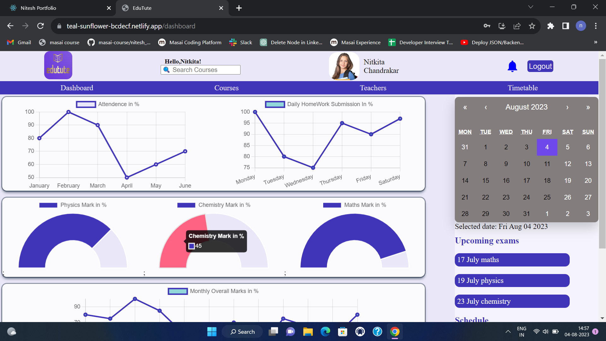
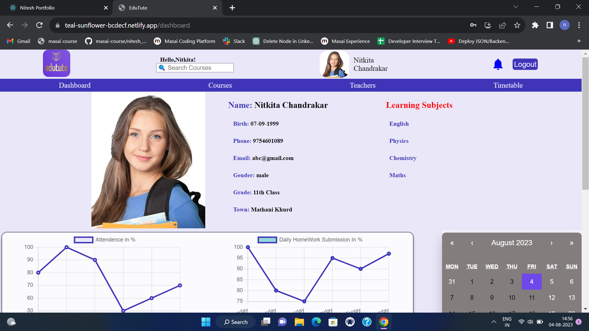
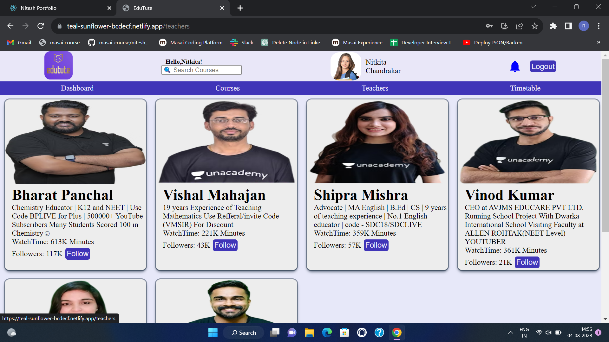
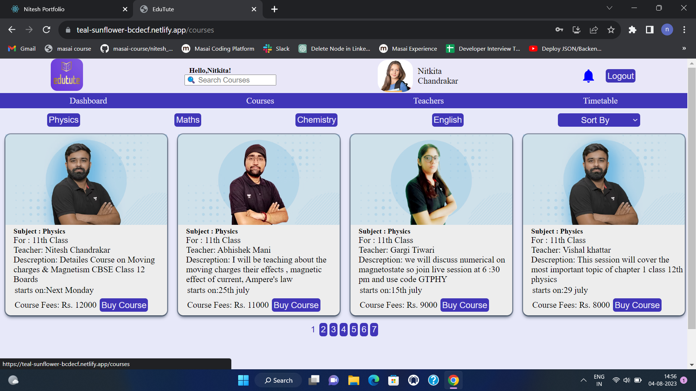
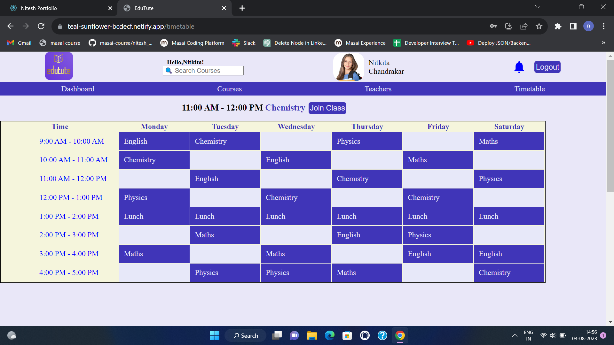

# EduTute 

Welcome to <b>Edutute</b>,Developed a website that replicates the functionality of Edutute, a student dashboard platform that provides information about tuition, study progress, class schedules, and exam details.

# Tech Stacks

## External Library

## For Deploying

- Live preview : https://teal-sunflower-bcdecf.netlify.app/

# Features
- Login
- sign up
- Find Courses
- Find Teachers
- TimeTable
- Profile Section
- Admin Page

# Different Pages of Website
### Homepage

### Profile

### Teachers

### Courses

### TimeTable

## Contact
Nitesh Chandrakar
Email : niteshchandrakar2@gmail.com
